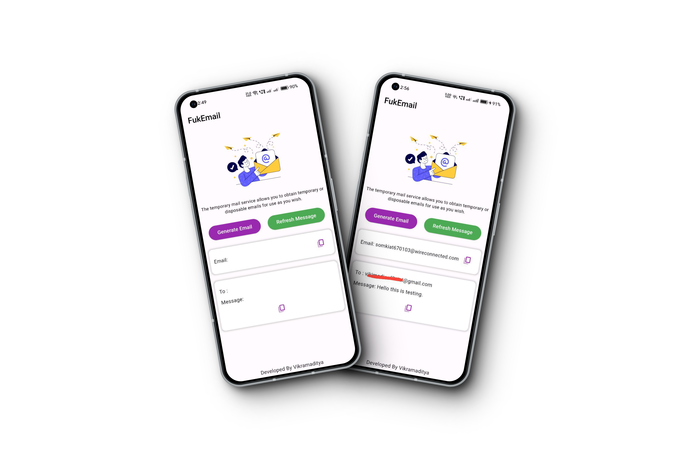

# FukMail

FukMail is a Flutter app that allows you to create a temporary email address for receiving and sending messages instantly.

## Screenshot

 

# 📑 Temp Mail API Documentation

Effortlessly manage temporary email accounts and messages with the Temp Mail API. This user-friendly and efficient solution is ideal for applications, websites, or new projects with temporary email services. 📧✨

## 📝 How to Get Started?

Getting started is simple with the Temp Mail API:

**😎 API Base URL:** `https://free-tempmail-api.vercel.app/api/`

### 1. 📨 Get New Mail Account
- **Endpoint:** `/newmail`
- **Method:** GET
- **Description:** Create a new temporary email account.
- **Query Parameters:** None
- **Example Request:**
  ```
  GET /newmail
  ```
- **Example Response:**
  ```json
  {
    "success": true,
    "newmail": {
      "email": "susan119776@hldrive.com",
      "token": " your token hare "
    }
  }
  ```


### 2. 📩 Get All Mail
- **Endpoint:** `/mails`
- **Method:** GET
- **Description:** Retrieve all emails in the temporary mailbox.
- **Query Parameters:** None
- **Headers:**
    - `mailtoken` (string, required): The authentication token for accessing the mailbox.
- **Example Request:**
  ```
  GET /mails
  Headers:
    mailtoken: your_token_here
  ```
- **Example Response:**
  ```json
  {
    "success": true,
    "mails": [{ get all mails here }]
  }
  ```


#

Begin your journey with the Temp Mail API today and experience the convenience of managing temporary email accounts effortlessly! 📧✨

# ⬇️ Download

- 📱 Android: [**Release ⚡**](https://github.com/VikramadityaDev/fukmail/releases)
- 📱 IOS: [**WebApp ⚡**](https://fukmail.pages.dev/)


## 🎉 Credits
We want to acknowledge and appreciate the hard work and creativity of our development team. They've made this API a reality. 🙌

- API Developer: [**Dev. Gaurav Jatt 👨‍💻**](https://github.com/devgauravjatt)
- Application Developer: [**VikramadityaDev 👨‍💻**](https://github.com/VikramadityaDev)
#